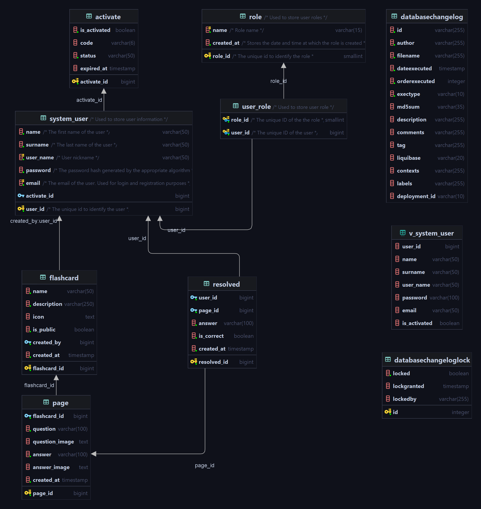

# Flashcards

A simple web application written in PHP and Java

## Overview

Flashcards is an application for creating and solving flashcards. It has a responsive user interface and a connection to a PostgreSQL database.

## Technologies

* HTML
* CSS
* JavaScript
* Java and Spring Boot
* NGINX
* PostgreSQL
* Liquibase
* Docker
* PHP

## Getting Started

1. In main application directory run command `docker-compose up`
2. Then go to your browser and paste this address [http://localhost:8080/index](http://localhost:8080/index)

## Database

The project uses a PostgreSQL database, which is managed by Liquibase. Liquibase is used to manage database migrations and write code in multiple formats, which is then converted to SQL. In this project, I use XML notation.

Entity Relationship Diagram (ERD)

